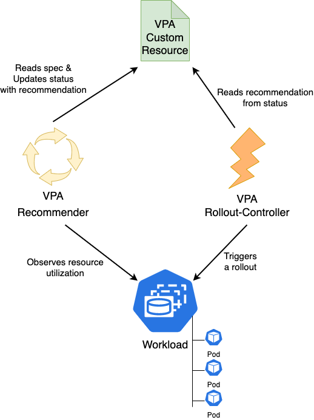

# Vertical Pod Autoscaler Rollout Controller

The `vpa-rollout-controller` is a simple Kubernetes controller based on client-go. It is built to improve availability of Kubernetes workloads that use the Vertical Pod Autoscaler by employing an alternate method to roll pods: it triggers a standard 'rollout restart' and thus allows pods to 'surge' (using `maxSurge`).

This controller works alongside the existing VPA components and adds the ability to roll out pod CPU & Memory 'resources' changes by triggering a rollout equivalent to that of the `kubectl rollout restart` command. This controller makes use of upstream VerticalPodAutoscaler components like the 'Admission Webhook', 'Recommender' and can work side-by-side with, or replace altogether, the 'Updater' component.  

### Why should I use this controller if I already use the upstream VerticalPodAutoscaler 'Updater'?
The [upstream VerticalPodAutoscaler](https://github.com/kubernetes/autoscaler/tree/master/vertical-pod-autoscaler)'s 'Updater' component works by explicitly evicting individual pods to force them to update their 'resources' block. This behaviour prevents the ability to 'surge' pods during rollouts. This is problematic for workloads that have a long termination and/or startup time (common in stateful workloads), since the workload will operate with n-1 pods for an extended period of time while the individual pods rollout changes, at a time when the Vertical Pod Autoscaler has recommended that this workload be given more horsepower.

This controller actually works in conjunction with the upstream VPA components, it relies on the recommendations that come from the 'Recommender' and after the controller has triggered a rollout, the 'Admission Webhook' ensures that pods are created with the desired 'resources'. This controller and the VPA 'Updater' can work in the same cluster, because they cannot operate on the same `VerticalPodAutoscaler` custom resources. The `vpa-rollout-controller` only triggers rollouts on `VerticalPodAutoscaler` custom resources that have their `updatePolicy.updateMode` set to `Initial` and have the Annotation `vpa-rollout.influxdata.io/enabled` set to `"true"`. By contrast, the upsteam VPA 'Updater' component only operates on `VerticalPodAutoscaler` custom resources that have their `updatePolicy.updateMode` set to `Recreate` (or `Auto`, but that is subject to change in future versions of the VPA).

## Table of Contents

- [Vertical Pod Autoscaler Rollout Controller](#vertical-pod-autoscaler-rollout-controller)
    - [Why should I use this controller if I already use the upstream VerticalPodAutoscaler 'Updater'?](#why-should-i-use-this-controller-if-i-already-use-the-upstream-verticalpodautoscaler-updater)
  - [Table of Contents](#table-of-contents)
  - [Running Locally](#running-locally)
  - [Requirements](#requirements)
    - [`VerticalPodAutoscaler` Resources](#verticalpodautoscaler-resources)
    - [`ClusterRole` \& `ClusterRoleBinding` Permissions](#clusterrole--clusterrolebinding-permissions)
    - [Usage](#usage)
  - [TO DO](#to-do)
  - [CLI Flags](#cli-flags)
  - [Annotations](#annotations)

## Running Locally
This app is meant to run as a pod inside a Kubernetes cluster, for which it will 

- Install `kind` and `docker`.
- `make dev` to build a kind cluster with local registry
- `make run` to build and deploy the controller

## Requirements

### `VerticalPodAutoscaler` Resources
- VPA resources must opt-in to be managed by the vpa-rollout-controller, by including the annotation `vpa-rollout.influxdata.io/enabled: "true"`.
- To ensure VPAs are not evicted by the upstream VPA's `Updater` component, the VPA resources must have the field `spec.updatePolicy.updateMode` set to `Initial`. 
- The Kubernetes workload resource (Deployment, StatefulSet, DaemonSet, etc.) targeted by the VPA must support the `kubectl.kubernetes.io/restartedAt` annotation for the controller to function.
  - Third party custom resources that respect this requirement are supported, e.g.: [OpenKruise CloneSets](https://openkruise.io/docs/user-manuals/cloneset/).

### `ClusterRole` & `ClusterRoleBinding` Permissions
- List and Read VPA resources
- Read and Patch the Target workload resources (Deployments, StatefulSets, DaemonSets, etc.)
- List and Read Pods

### Usage

TBD

## TO DO
- make install/deploy to run into kubectl context

## CLI Flags

The following table lists the CLI flags supported by the vpa-rollout-controller:

| Flag | Type | Default Value | Description |
|------|------|---------------|-------------|
| `diffPercentTrigger` | int | `10` | Percentage difference between VPA recommendation and current resources that triggers a rollout |
| `cooldownPeriod` | duration | `15m` | Cooldown period before triggering another rollout for the same workload |
| `loopWaitTime` | int | `30` | Time in seconds to wait between each loop iteration |
| `patchOperationFieldManager` | string | `flux-client-side-apply` | Field manager name for patch operations |

## Annotations

These annotations can be added to `VerticalPodAutoscaler` resources to customize the behavior of the vpa-rollout-controller:

| Annotation | Type | Description |
|------------|------|-------------|
| `vpa-rollout.influxdata.io/enabled` | boolean | Required annotation to enable a VPA to be managed by the controller. Must be set to `"true"` |
| `vpa-rollout.influxdata.io/cooldown-period` | duration | Override the default cooldown period for a specific VPA. Accepts a valid Go duration string (e.g., `"15m"`, `"1h"`) |
| `vpa-rollout.influxdata.io/diff-percent-trigger` | int | Override the default percentage difference that triggers a rollout for a specific VPA |