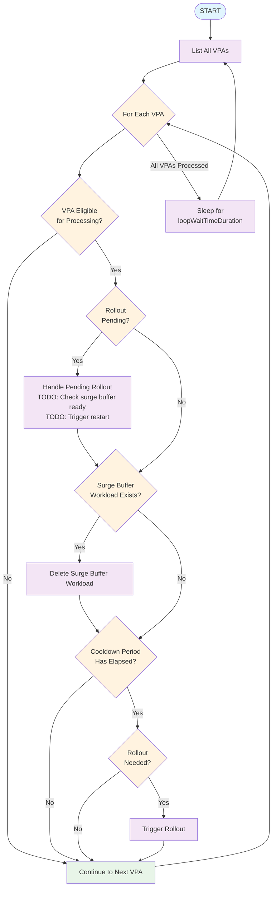

# Vertical Pod Autoscaler Rollout Controller

The `vpa-rollout-controller` is a simple Kubernetes controller based on client-go. It is built to improve availability of Kubernetes workloads that use the Vertical Pod Autoscaler by employing an alternate method to roll pods: it triggers a standard 'rollout restart' and thus allows pods to 'surge' (using `maxSurge`).

This controller works alongside the existing VPA components and adds the ability to roll out pod CPU & Memory 'resources' changes by triggering a rollout equivalent to that of the `kubectl rollout restart` command. This controller makes use of upstream VerticalPodAutoscaler components like the 'Admission Webhook', 'Recommender' and can work side-by-side with, or replace altogether, the 'Updater' component.  


### Why should I use this controller if I already use the upstream VerticalPodAutoscaler 'Updater'?
The [upstream VerticalPodAutoscaler](https://github.com/kubernetes/autoscaler/tree/master/vertical-pod-autoscaler)'s 'Updater' component works by explicitly evicting individual pods to force them to update their 'resources' block. This behaviour prevents the ability to 'surge' pods during rollouts. This is problematic for workloads that have a long termination and/or startup time (common in stateful workloads), since the workload will operate with n-1 pods for an extended period of time while the individual pods rollout changes, at a time when the Vertical Pod Autoscaler has recommended that this workload be given more horsepower.

This controller actually works in conjunction with the upstream VPA components and **requires them to be installed**. It relies on the recommendations that come from the 'Recommender' and after the controller has triggered a rollout, the 'Admission Webhook' ensures that pods are created with the desired 'resources'. This controller and the VPA 'Updater' can work in the same cluster, because they cannot operate on the same `VerticalPodAutoscaler` custom resources. The `vpa-rollout-controller` only triggers rollouts on `VerticalPodAutoscaler` custom resources that have their `updatePolicy.updateMode` set to `Initial` and have the Annotation `vpa-rollout.influxdata.io/enabled` set to `"true"`. By contrast, the upsteam VPA 'Updater' component only operates on `VerticalPodAutoscaler` custom resources that have their `updatePolicy.updateMode` set to `Recreate` (or `Auto`, but that is subject to change in future versions of the VPA).


## Table of Contents

- [Vertical Pod Autoscaler Rollout Controller](#vertical-pod-autoscaler-rollout-controller)
    - [Why should I use this controller if I already use the upstream VerticalPodAutoscaler 'Updater'?](#why-should-i-use-this-controller-if-i-already-use-the-upstream-verticalpodautoscaler-updater)
  - [Table of Contents](#table-of-contents)
  - [Running Locally](#running-locally)
    - [Prerequisites](#prerequisites)
  - [Requirements](#requirements)
    - [Upstream Kubernetes VerticalPodAutoscaler Components](#upstream-kubernetes-verticalpodautoscaler-components)
    - [`VerticalPodAutoscaler` Custom Resources](#verticalpodautoscaler-custom-resources)
    - [`ClusterRole` \& `ClusterRoleBinding` Permissions](#clusterrole--clusterrolebinding-permissions)
  - [Concepts](#concepts)
    - [Surge Buffers](#surge-buffers)
    - [Pending Rollouts](#pending-rollouts)
    - [Controller Flow](#controller-flow)
    - [Usage](#usage)
      - [Example VPA Configuration](#example-vpa-configuration)
      - [Rollout Status Values](#rollout-status-values)
  - [CLI Flags](#cli-flags)
  - [Annotations](#annotations)
  - [Labels](#labels)
  - [Pod Annotations](#pod-annotations)
  - [Scalability](#scalability)

## Running Locally

This app is meant to run as a pod inside a Kubernetes cluster. For local development:

- Install `kind` and `docker`
- Run `just dev` to build a kind cluster with local registry
- Run `just run` to build and deploy the controller

### Prerequisites

- Go 1.21+
- Docker
- kubectl
- kind (for local development)


## Requirements

### Upstream Kubernetes VerticalPodAutoscaler Components

The upstream [Kubernetes VerticalPodAutoscaler](https://github.com/kubernetes/autoscaler/tree/master/vertical-pod-autoscaler) components must be installed and running in your cluster for this controller to function properly.

Specifically, you need:
- **VPA Recommender**: Generates resource recommendations based on historical usage
- **VPA Admission Webhook**: Applies resource recommendations to new pods during creation

> **Note**: The VPA Updater component is **not required**, but does not interfere when using this controller, as both controllers serve similar purposes but use different approaches.

### `VerticalPodAutoscaler` Custom Resources
- VPA resources must opt-in to be managed by the vpa-rollout-controller, by including the annotation `vpa-rollout.influxdata.io/enabled: "true"`.
- To ensure VPAs are not evicted by the upstream VPA's `Updater` component, the VPA resources must have the field `spec.updatePolicy.updateMode` set to `Initial`. 
- The Kubernetes workload resource (Deployment, StatefulSet, DaemonSet, etc.) targeted by the VPA must support the `kubectl.kubernetes.io/restartedAt` annotation for the controller to function.
  - Third party custom resources that respect this requirement are supported, e.g.: [OpenKruise CloneSets](https://openkruise.io/docs/user-manuals/cloneset/).

### `ClusterRole` & `ClusterRoleBinding` Permissions

The controller requires the following RBAC permissions:

```yaml
apiVersion: rbac.authorization.k8s.io/v1
kind: ClusterRole
metadata:
  name: vpa-rollout-controller
rules:
- apiGroups: ["autoscaling.k8s.io"]
  resources: ["verticalpodautoscalers"]
  verbs: ["get", "list", "patch"]
- apiGroups: ["apps"]
  resources: ["deployments", "statefulsets"]
  verbs: ["get", "list", "patch", "create", "delete"]
- apiGroups: [""]
  resources: ["pods"]
  verbs: ["get", "list"]
```


## Concepts

### Surge Buffers
For the workloads that require it, we can create a copy of the workload resource (StatefulSet, Deployment, etc.) that will serve as a buffer during the rollout. This solves the problem where with the Kubernetes Vertical Pod Autoscaler, your workload must operated with `n-1` pods for the duration of the rollout restart. The surge buffer acts as a +1, so your workload instead operates with `n` pods for the duration of the rollout restart.

For VPAs that configure it (via the annotation `vpa-rollout.influxdata.io/surge-buffer-enabled: true`), Surge Buffer Workloads are created before a rollout is triggered and are deleted shortly after the rollout is completed.

### Pending Rollouts
For Surge Buffer pods to be able to fulfill their role, we have to wait for them to have the status `Running` with all of its containers `Ready`. That can take seconds or minutes, so `vpa-rollout-controller` therefore sets the annotation `vpa-rollout.influxdata.io/rollout-status` to `pending` as a signal that this workload needs a rollout, then creates the Surge Buffer workload resource. In a future loop, it will verify that the Surge Buffer workload is ready before actually triggering a rollout.

### Controller Flow

The following diagram illustrates the main processing flow of the VPA Rollout Controller:



**Key Flow Characteristics:**
- **Continuous Monitoring**: Infinite loop ensures constant VPA evaluation
- **Non-blocking**: Errors with one VPA don't affect processing of others  
- **State Management**: Handles pending rollouts and surge buffer lifecycle
- **Configurable**: Multiple parameters allow tuning for different environments

### Usage

To use the `vpa-rollout-controller`, you need to:

1. **Deploy the Controller**: The controller runs as a pod inside your Kubernetes cluster
2. **Create VPA Resources**: Configure VPAs with the required annotations
3. **Target Workloads**: Ensure your workloads support rollout restarts

#### Example VPA Configuration

```yaml
apiVersion: autoscaling.k8s.io/v1
kind: VerticalPodAutoscaler
metadata:
  name: my-app-vpa
  namespace: default
  annotations:
    vpa-rollout.influxdata.io/enabled: "true"
    vpa-rollout.influxdata.io/diff-percent-trigger: "15"
    vpa-rollout.influxdata.io/cooldown-period: "10m"
    vpa-rollout.influxdata.io/surge-buffer-enabled: "true"
    vpa-rollout.influxdata.io/number-of-surge-buffer-pods: "2"
spec:
  targetRef:
    apiVersion: apps/v1
    kind: Deployment
    name: my-app
  updatePolicy:
    updateMode: Initial  # Required: prevents upstream VPA updater from managing this VPA
  resourcePolicy:
    containerPolicies:
    - containerName: app
      controlledResources: ["cpu", "memory"]
      maxAllowed:
        cpu: "2"
        memory: "4Gi"
      minAllowed:
        cpu: "100m"
        memory: "128Mi"
```

#### Rollout Status Values

The controller uses the `vpa-rollout.influxdata.io/rollout-status` annotation to track rollout state:

- **`pending`**: A surge buffer workload has been created and the controller is waiting for it to be ready
- **`in-progress`**: A rollout has been triggered and is currently executing
- **`completed`**: The rollout has finished successfully
- **(no annotation)**: No rollout is currently needed or in progress

## CLI Flags

The following table lists the CLI flags supported by the vpa-rollout-controller:

| Flag | Type | Default Value | Description |
|------|------|---------------|-------------|
| `diffTriggerPercentage` | int | `10` | Percentage difference between VPA recommendation and current resources that triggers a rollout. |
| `cooldownPeriodDuration` | duration | `15m` | Cooldown period before allowing another rollout to occur for the same workload. |
| `loopWaitTimeSeconds` | int | `30` | Time in seconds to wait between each loop iteration. |
| `patchOperationFieldManager` | string | `flux-client-side-apply` | Field manager name for patch operations. Useful for telling GitOps tools to not reconcile away 'rollout' annotations. |

## Annotations

These annotations can be added to `VerticalPodAutoscaler` resources to customize the behavior of the vpa-rollout-controller:

| Annotation | Type | Description |
|------------|------|-------------|
| `vpa-rollout.influxdata.io/enabled` | boolean | Required annotation to enable a VPA to be managed by the controller. Must be set to `"true"`. |
| `vpa-rollout.influxdata.io/cooldown-period` | duration | Override the default cooldown period for a specific VPA. Accepts a valid Go duration string (e.g., `"15m"`, `"1h"`). |
| `vpa-rollout.influxdata.io/diff-percent-trigger` | int | Override the default percentage difference that triggers a rollout for a specific VPA. |
| `vpa-rollout.influxdata.io/surge-buffer-enabled` | boolean | Enables the surge buffer feature for the VPA's target workload. When set to `"true"`, a surge buffer workload is created during rollout. |
| `vpa-rollout.influxdata.io/number-of-surge-buffer-pods` | int | Overrides the number of surge buffer pods to create for the VPA's target workload during a rollout. You should typically set this value to the value you use for 'maxSurge', if it is more than 1. Default is `1`. |
| `vpa-rollout.influxdata.io/rollout-status` | string | **Internal annotation managed by the controller**. Tracks rollout state: `pending`, `in-progress`, `completed`. Do not set manually. |

## Labels

The controller uses the following labels on pods:

| Label | Type | Description |
|-------|------|-------------|
| `vpa-rollout.influxdata.io/surge-buffer` | string | Applied to surge buffer pods with value `"true"`. Used by the controller to distinguish surge buffer pods from regular workload pods. |

## Pod Annotations

Surge buffer pods are automatically created with these annotations:

| Annotation | Value | Description |
|------------|-------|-------------|
| `cluster-autoscaler.kubernetes.io/safe-to-evict` | `"false"` | Prevents the cluster autoscaler from evicting surge buffer pods during rollouts. |

## Scalability
`vpa-rollout-controller` has not been tested in large clusters, with more than 10 VerticalPodAutoscaler resources.